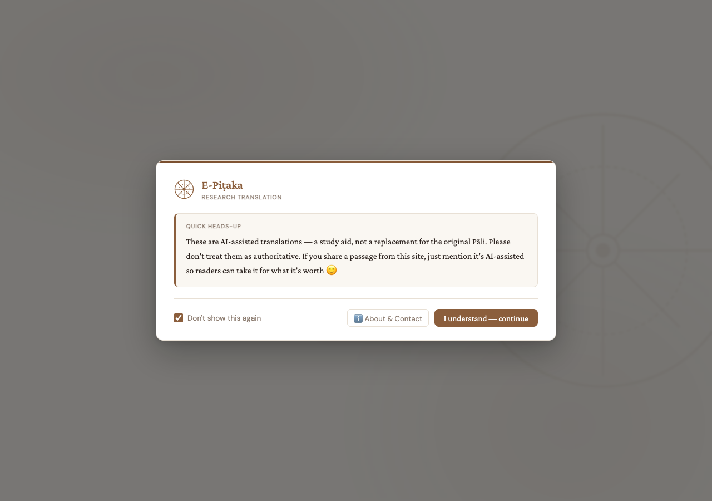
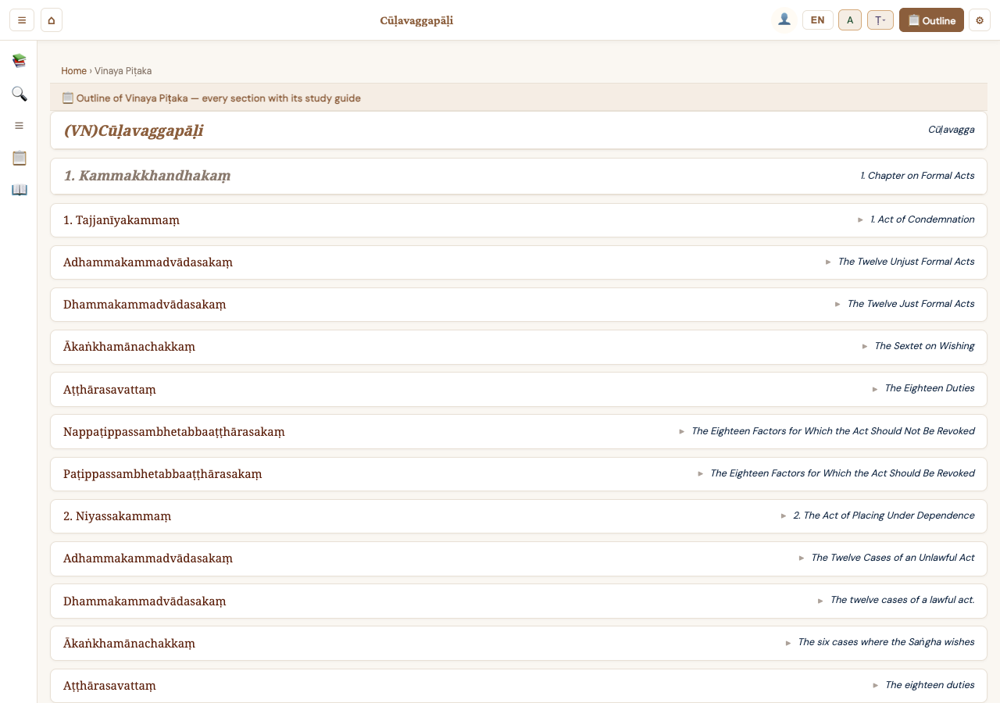
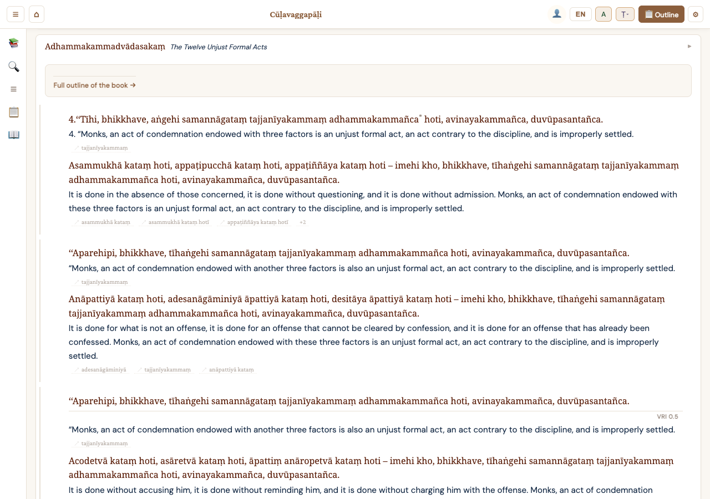
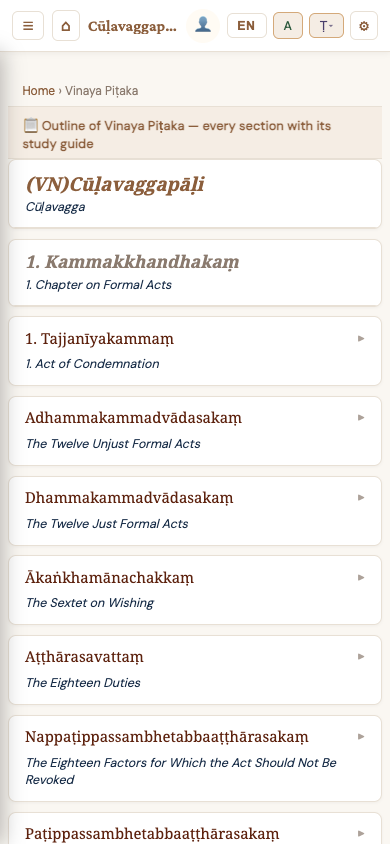
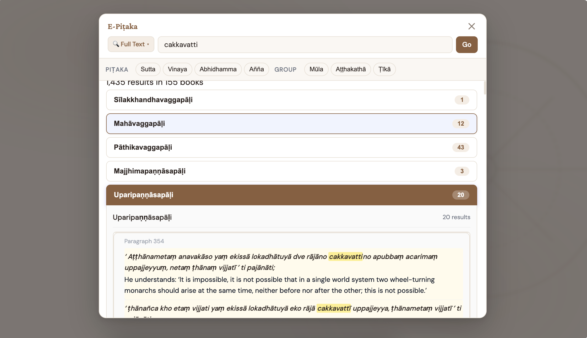
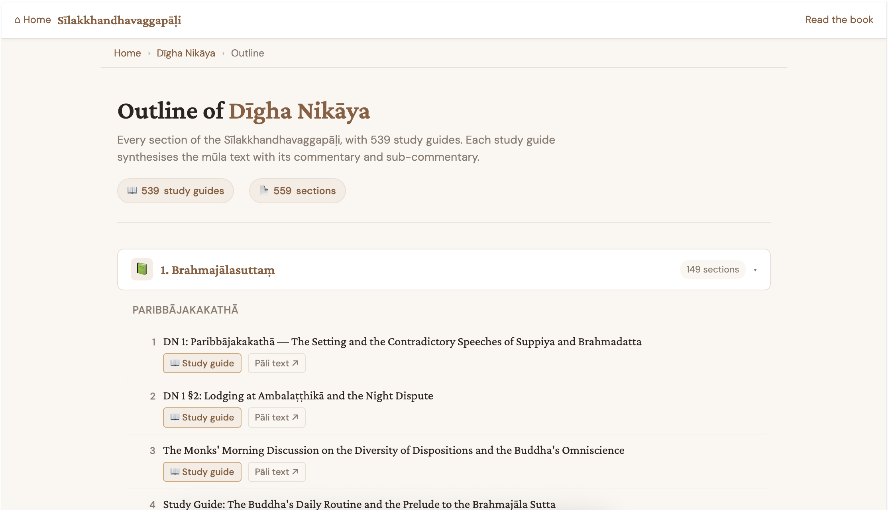

# E-Piṭaka

**[epitaka.org](https://epitaka.org)** — An open-source, AI-assisted reader for the Chaṭṭha Saṅgāyana (Sixth Council) Tipiṭaka, with commentaries and sub-commentaries displayed inline alongside the root Pāli text.

> *Read the Buddha's words — with their traditional explanations — in one place.*

---

## 🌐 Live Site

**[https://epitaka.org](https://epitaka.org)**

---

## What is E-Piṭaka?

E-Piṭaka makes the entire Pāli Canon accessible to modern readers by combining:

- **Line-by-line AI translations** verified against multiple authoritative sources
- **Inline commentaries** (Aṭṭhakathā) and **sub-commentaries** (Ṭīkā) — see the explanation of each passage directly within the reader
- **Cross-references** between root texts, commentaries, and sub-commentaries — navigate the entire Tipiṭaka's interconnected literature with a single click

The Pāli text follows the [VRI (Vipassana Research Institute)](https://tipitaka.org) edition of the Chaṭṭha Saṅgāyana Tipiṭaka.

---

## Screenshots

### 🏠 Home Page


*The home page lets you choose your language and browse the entire Tipiṭaka collection.*

### 📖 Book Reader with Inline Commentary


*Each section shows the Pāli root text alongside its AI-assisted translation. Commentaries and sub-commentaries are linked inline — click a section heading to expand and read the traditional explanation.*

### 📖 Reader with Translations Loaded


*After the AI translations load, each sentence shows the original Pāli alongside an English translation drawn from multiple authoritative sources and verified against the commentary.*

### 📱 Mobile Reading Experience


*The reader is fully responsive — read on your phone or tablet with the same rich experience.*

### 🔍 Search


*Search across the entire Pāli Canon — find passages by Pāli words, English translations, or section headings.*

### 📚 Outline with Study Guides


*Every section has a structured outline with AI-generated study guides that synthesize the mūla text with its commentary and sub-commentary.*

---

## ✨ Features

### AI-Assisted Translation Pipeline

The translations on E-Piṭaka are not machine-translated from scratch. They are produced through a careful multi-step process:

1. **Source Gathering** — Existing translations are collected from multiple authoritative sources:
   - 🇬🇧 English: Bhikkhu Bodhi, Anandajoti Bhikkhu, E.B. Cowell, and others
   - 🇱🇰 Sinhala: [tipitaka.lk](https://tipitaka.lk)
   - 🇹🇭 Thai: Mahāmakut Royal Edition
   - 🇲🇲 Myanmar Nissaya (interlinear): [wikipali.org](https://wikipali.org)
   - 🇻🇳 Vietnamese: [tamtangpaliviet.net](https://tamtangpaliviet.net)

2. **Algorithmic Alignment** — Each source is matched to the VRI paragraph structure so the same passage can be compared across languages.

3. **Sentence-Level AI Translation** — For each Pāli sentence, the aligned source translations are sent to an AI language model, which produces a new translation drawing on all sources.

4. **Context Enrichment** — The AI is given rich context including:
   - The relevant **commentary (Aṭṭhakathā)** and **sub-commentary (Ṭīkā)**
   - A **glossary** of key terms and preferred translations
   - **Pāli definitions** from previous translation runs
   - **Translations of preceding sections** for style consistency

5. **Verification Pass** — The AI-generated translation is checked again against the original Pāli to catch misinterpretations.

6. **Human Review** — A human reader reviews results, feeds back corrections, and adjusts the process for the next cycle.

> **These are research translations, not authoritative renderings.** They are meant to help readers engage with the original Pāli more directly. Please do not quote them as final or definitive.

### 📖 Inline Commentaries & Sub-Commentaries

One of the unique features of E-Piṭaka is the ability to read the **Tipiṭaka with its traditional commentaries inline**:

- **Mūla (Root Text)** — The original Pāli Canon (Sutta, Vinaya, Abhidhamma)
- **Aṭṭhakathā (Commentary)** — The traditional explanations by Ven. Buddhaghosa and other commentators
- **Ṭīkā (Sub-Commentary)** — Further elaborations by later scholars

When you read a section, the **M / A / Ṭ buttons** in the top bar track your position and link to the corresponding passage in each layer of the literature. This lets you understand each passage in its full traditional context — something previously requiring multiple books open simultaneously.

### 🔍 Powerful Search

- **Heading Search** — Find sections by their titles
- **Full-Text Search** — Search across all Pāli text and translations
- **Pāli Dictionary** — Look up individual Pāli words with definitions
- **AI Semantic Search** — Find conceptually related passages using AI

### 🌍 Multi-Language Support

Read in multiple languages with the same interface:
- **English** — AI-assisted translations from multiple source traditions
- **Vietnamese** — Translation from tamtangpaliviet.net
- More languages planned

### 📱 Pāli Script Conversion

Read the Pāli text in any major Southeast Asian script:
- Roman (standard)
- Myanmar (Burmese)
- Thai
- Khmer
- Lao
- Sinhala
- Devanagari
- And many more...

### 🎨 Customizable Reading Experience

- **Layout**: Stacked (Pāli above translation) or side-by-side
- **Theme**: Light, dark, or system default
- **Font size**: Adjustable from 10px to 32px
- **Colors**: Customize Pāli and translation text colors
- **Page numbers**: VRI, PTS, Myanmar, or Thai editions

---

## 🏗️ Architecture

```
epitaka.org/
├── web_server/                  # Flask web application
│   ├── app/                     # Application factory & blueprints
│   │   ├── routes/              # URL handlers (main, api, auth, editor)
│   │   ├── services/            # Business logic (search, DB init)
│   │   └── utils/               # Helpers (assets, auth)
│   ├── frontend/                # Vite-built frontend
│   │   ├── src/                 # Source JS/CSS
│   │   │   ├── book.js          # Book reader logic
│   │   │   ├── index.js         # Home page logic
│   │   │   ├── css/book.css     # Reader styles
│   │   │   └── pali-script.js   # Script conversion engine
│   │   └── dist/                # Built assets (served by Flask)
│   ├── templates/               # Jinja2 HTML templates
│   │   ├── book.html            # Book reader page
│   │   ├── index.html           # Home page
│   │   ├── search.html          # Search results
│   │   ├── outline.html         # Section outline with study guides
│   │   └── about.html           # About the translation
│   ├── static/                  # Fallback static files
│   └── dockerfile               # Container deployment
├── translator/                  # AI translation pipeline
│   ├── translate.py             # Main translation script
│   ├── dbwriter.py              # Database writer
│   └── convert_md2db.py         # Markdown to SQLite converter
├── data/                        # SQLite databases
│   ├── epitaka.db               # Main Pāli text database
│   └── translations.db          # Translation database
└── scripts/                     # Utility scripts
```

### Tech Stack

| Layer | Technology |
|-------|-----------|
| **Backend** | Python / Flask |
| **Frontend** | Vanilla JS / Vite |
| **Database** | SQLite (FTS5 for full-text search) |
| **Auth** | Firebase Authentication |
| **AI Translation** | Multi-model pipeline with source verification |
| **Deployment** | Docker / WSGI |

---

## 🚀 Getting Started

### Prerequisites

- Python 3.10+
- Node.js 18+ (for frontend build)
- SQLite

### Local Development

```bash
# Clone the repository
git clone https://github.com/dhammanana/epitaka.org.git
cd epitaka.org

# Install Python dependencies
cd web_server
pip install -r requirements.txt

# Build frontend
cd frontend
npm install
npm run build

# Run the development server
cd ..
python run.py
```

The site will be available at `http://localhost:8080`.

### Docker

```bash
cd web_server
docker-compose up --build
```

---

## 📊 Database

E-Piṭaka uses SQLite with the following key tables:

| Table | Description |
|-------|-------------|
| `books` | Tipiṭaka hierarchy (categories, nikāyas, books) |
| `headings` | Section headings with hierarchy levels |
| `sentences` | Pāli text with translations (English, Vietnamese) |
| `words` | Pāli dictionary for autocomplete |
| `sentences_fts` | FTS5 virtual table for full-text search |

---

## 🤝 Contributing

Contributions are welcome! Whether it's:
- Fixing a translation error
- Suggesting a better source
- Improving the UI
- Adding a new language

Please open an issue or pull request on [GitHub](https://github.com/dhammanana/epitaka.org).

---

## 📬 Contact

For questions, suggestions, or corrections:

**epitaka.org@gmail.com**

---

## 📜 License

This project is open source. See the [GitHub repository](https://github.com/dhammanana/epitaka.org) for license details.

---

## 🙏 Acknowledgements

- **VRI (Vipassana Research Institute)** — For the Chaṭṭha Saṅgāyana digital edition
- **Bhikkhu Bodhi** — English translations of the Nikāyas
- **Anandajoti Bhikkhu** — English translations and Pāli resources
- **[wikipali.org](https://wikipali.org)** — Myanmar Nissaya digitalization
- **[tipitaka.lk](https://tipitaka.lk)** — Sinhala translations
- **[Digital Pāli Dictionary](https://github.com/digitalpalidictionary/dpd-db)** — Pāli definitions
- **Monks and teachers at IIT** — [theravado.com](https://theravado.com)
- **Quảng An** — Server donation and management

---

<p align="center">
  <a href="https://epitaka.org">epitaka.org</a> — Free to read online<br>
  <em>May all beings be happy. May all beings be free.</em>
</p>
